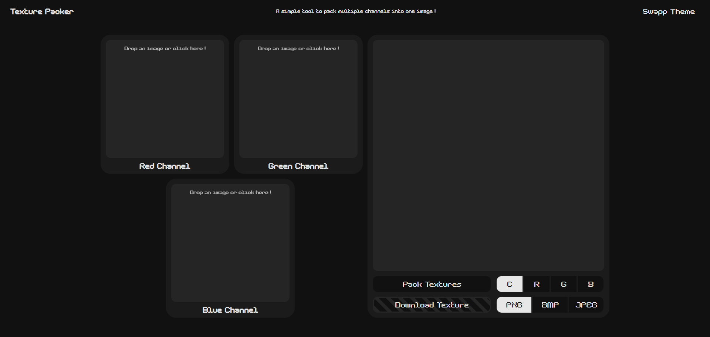

# Texture Packer

## This project is a simple PWA texture channel packer build on top of typescript, HTML canvases and web components.

## Texture packers

A texture channel packer is a tool to combine greyscale images into a single image using its multiple greyscale channels (red, green, blue, alpha).

This can be usefull to optimize textures memory consumption in games en rendring engines.

### Issue this this tool

This texture packer as the can combine three images into one RGB image. Unfortunately, due to the way javascript exports png images using a pre-multiplied alpha, using the alpha channel would require creating or modifying an existing png exporter.

## PWA

A PWA or progressive wab app is a web page/ web aplication that can be installed on desktop and mobile to be accessible event offline and can work more like a "native" app.

## Where to find the tool online ?

The tool is available [here](https://jame.works/texture-packer)

## How to use the tool

The layout is quite simple and navigatable using mouse or keyboard

There is :

- three images inputs that you can click, navigate with keyboard or directly drop files into.
- one button to begin channel packing
- one channel display selector
- one download button
- one image format selector
- one theme swap button

The app hase light and dark mode swtching using the button or using `alt+t` shortcut.
